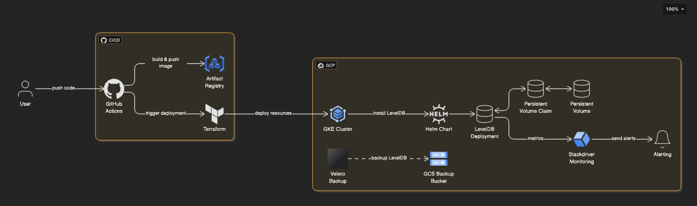
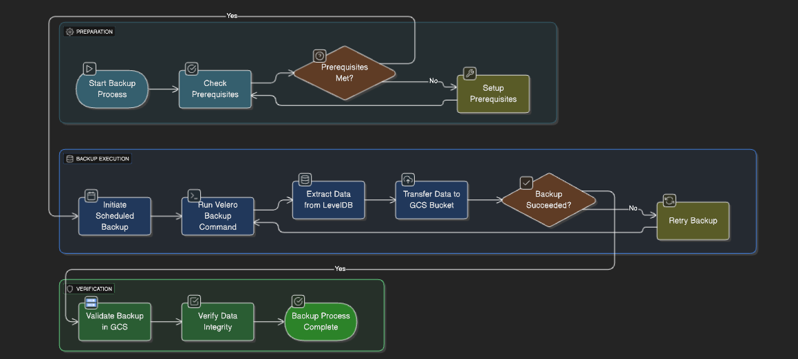

# LevelDB k8s Deployment with Resilience, Backup, and Observability

## 🚀 Overview

This project demonstrates a **Kubernetes-native** high availability and backup-ready setup for a LevelDB-based application, with:

- **Resilient architecture** capable of auto-healing and recovery.
- **Restic + LVM-based Velero** integration for snapshot backups.
- **Terraform-driven IaC** for reproducibility and portability.
- **CI/CD with GitHub Actions**.
- **Monitoring with Stackdriver (Cloud Monitoring & Logging)**.
- **GCP-first setup**, but portable to any CNCF-compliant cloud like AWS, Azure, etc.

---

## 📐 High-Level Architecture Flow

## ✅ Functional Highlights

### 📦 Resilience and Recovery
LevelDB is deployed as a Kubernetes StatefulSet with GCE Persistent Disks to ensure data persistence during node or pod failures. Readiness and liveness probes are configured for automated health checks and recovery.

### 💾 Backup & Restore
Backups are handled using Velero with Restic, leveraging LVM snapshots on the node for consistent and efficient volume-level backups, supporting up to 2 TB per pod. Snapshots run every 6 hours to meet the defined RPO. Restore procedures are fully automated and optimized to minimize performance impact.

### 📈 Scalability

LevelDB is inherently single-node and does not support clustering or concurrent writes, making horizontal scaling unfeasible in Kubernetes. Since GCE Persistent Disks are `ReadWriteOnce`, they cannot be shared across multiple pods. Vertical scaling is implemented using Kubernetes VPA to automatically adjust CPU and memory limits for optimal performance of the single LevelDB instance.

For applications that require high availability and horizontal scalability, a better alternative is **Apache Cassandra**. It is a distributed, masterless database that supports replication, clustering, and fault tolerance — making it a strong fit for scalable, production-grade Kubernetes deployments.

### 🚚 Migration Strategy
To minimize downtime during migration, start by redirecting **all new writes** to the LevelDB instance running on Kubernetes, while continuing to serve **reads from the legacy instance**. Once write traffic is stabilized, begin migrating historical data from the old instance to the new one in batches.

After the data is fully copied and verified, gradually shift read traffic to the Kubernetes instance and decommission the legacy node. This staged approach ensures a smooth transition with minimal impact on ongoing operations.

### 🔍 Monitoring & Observability
Integrated with Stackdriver for logs and metrics collection. Alerts are configured for pod restarts, node issues, and backup failures. Developers can inspect logs via Logs Explorer and use dashboards for debugging.

### 🔐 Security & Tooling
Infrastructure is provisioned using Terraform and deployed via GitHub Actions. IAM roles follow least-privilege principles, backups are encrypted at rest in GCS, and the cluster uses RBAC and optionally OPA/Gatekeeper for policy enforcement.

## 📐 Backup  Flow

